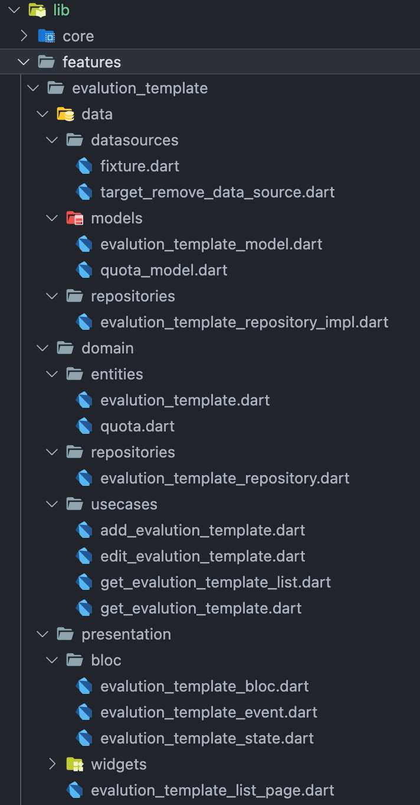

## 介绍
**Domain 中间层** 作为 **Data 数据层** 与 **Presentation 展示层** 数据交互的桥梁。

## 原因
为了减少代码耦合，将项目中每个需求模块进行分层开发，可细粒度排查开发过程出现的问题。

### Domain 层
- Entities：实体
- Repositories：抽象 Data 层接口（与 Data 层关联）
- Use cases：暴露给 Presentation 层使用（与 Presentation 层关联）

### Data 层
- Models：用于数据解析（继承于 Domain 层实体）
- Data Sources：与后端接口交互
- Repositories：实现 Domain 层的抽象接口

### Presentation 层
- Presentation Login Holders 展示层逻辑
  - Bloc 状态管理
- Widgets 组件

<!-- 
### 项目结构示例图
 -->